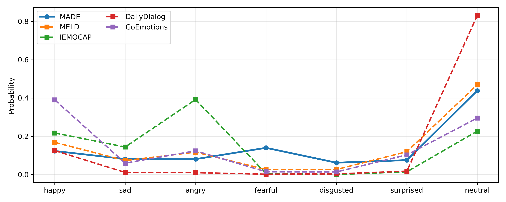
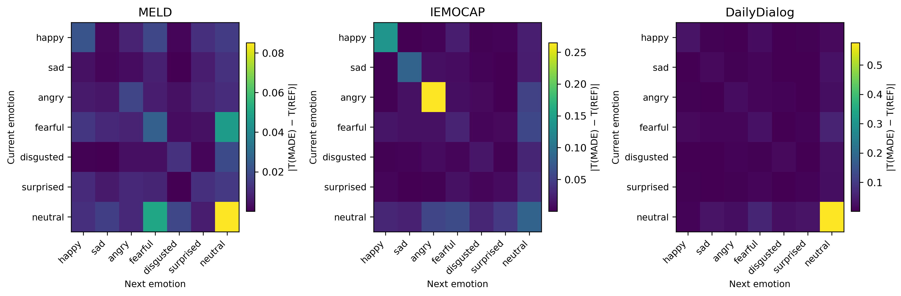
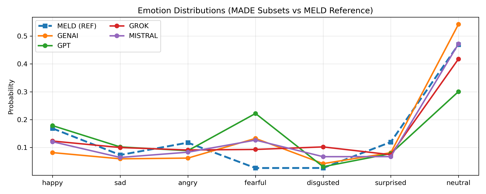
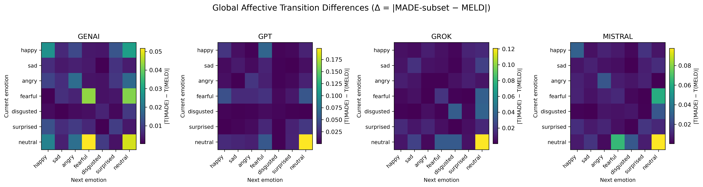

# Repository Objective

The objective of this repository is to construct and validate MADE
(Monologue-based Artificial Discourse for Emotion Analysis), a large-scale
synthetic monologue dataset designed to support research on affective
coherence, emotional dynamics, and semantic consistency in spontaneous speech.

This repository addresses a fundamental limitation of existing
human-annotated speech emotion datasets: limited scale, restricted emotional
diversity, and strong reliance on dialogue- or turn-level annotations. Such
constraints hinder systematic analysis of emotion transitions, long-range
affective consistency, and distributional robustness—properties that are
increasingly critical for modern speech and language models.

To overcome these limitations, the repository provides a complete and
reproducible pipeline for:
- generating emotionally annotated single-speaker monologues using multiple
  large language models,
- normalizing heterogeneous emotion labels into a unified 7-class taxonomy,
- cleaning and validating synthetic outputs through structural and statistical
  quality checks,
- and quantitatively comparing the resulting dataset against established
  human-annotated benchmarks.

Stage 1 focuses exclusively on **dataset-level validation**, rather than
downstream model training or model-based evaluation. The goal is to determine
whether MADE exhibits distributional, semantic, and affective transition
properties comparable to real-world datasets such as MELD, IEMOCAP, and
DailyDialog.

## Environment Setup

This repository provides two Conda environment specifications for cross-platform reproducibility:

- `environment_linux.yml` — Linux systems (GPU/CUDA supported)
- `environment_macos.yml` — macOS systems (CPU / Apple Silicon)

### Prerequisites
- Conda (Miniconda or Anaconda)

### Linux
```bash
conda env create -f environment_linux.yml
conda activate made
```

### MacOS
```bash
conda env create -f environment_macos.yml
conda activate made
```

## 1) Prepare Reference Datasets

- `scripts/db_meld_prepare.py`  
  Reads `train/dev/test` CSV files under `download/MELD`, normalizes emotion labels into **7 classes**, and writes each dialogue as  
  `dataset/MELD/{split}/dialog_*.json`.

```bash
python scripts/db_meld_prepare.py
```

- `scripts/db_dailydialog_prepare.py`  
  Reads TXT files under `download/DailyDialog/{train,val,test}`, converts conversations and emotion/speech-act labels into  
  `dataset/DailyDialog/{split}/dialog_*.json`.

```bash
python scripts/db_dailydialog_prepare.py
```

- `scripts/db_iemocap_prepare.py`  
  Merges IEMOCAP transcripts with emotion annotations, maps labels into **7 classes**, and writes JSON outputs under  
  `dataset/IEMOCAP/`.

```bash
python scripts/db_iemocap_prepare.py
```

- `scripts/db_goemotions_prepare.py`  
  Converts the GoEmotions dataset into the unified 7-class emotion taxonomy and writes sentence-level JSON files under  
  `dataset/GoEmotions/`.

```bash
python scripts/db_goemotions_prepare.py

```
## 2) Synthetic Monologue Generation (MADE)

This step generates the MADE synthetic monologue dataset using a shared scene prompt and multiple LLM backends. Each generation request produces **7 monologues**, where each monologue contains **10–15 sentences** and **an emotion label per sentence**.

- **Shared prompt**: `scripts/cookie_theft_picture.txt`  
  A fixed *Cookie Theft picture description* scene is used to keep content comparable across models and runs.

- **Generation scripts (per model)**:  
  - `scripts/gpt_gen_monolog_with_emo.py`  
  - `scripts/mistral_gen_monolog_with_emo.py`  
  - `scripts/grok_gen_monolog_with_emo.py`  
  - `scripts/genai_gen_monolog_with_emo.py`  

  Each script targets ~**2500 monologues** and saves outputs under:  
  `dataset/MADE/{model}_monologues_with_emo/`

- **Repetition filtering (quality control)**  
  For GPT/Mistral/Grok/Gemini variants, both **local** and **global** repetition checks are applied. If the same sentence appears **3+ times**, the monologue is skipped to reduce templated or degenerate generations.

## 3) Label/Format Correction + Quality Control

After generation, MADE outputs are normalized into a consistent JSON schema and then validated to catch structural issues and low-quality samples.

### Label and Format Fixes
- `scripts/correct_gpt_dataset.py`  
  Maps GPT-generated labels into the **7-class emotion set**, adds `speaker="PAR"`, and rewrites files into a unified structure with:
  `id / label / segments`.

- `scripts/correct_dataset.py`  
  A general-purpose normalizer that applies label mapping and light structural cleanup (e.g., harmonizing differences such as
  `list` vs `utterances` vs `segments`).

### Quality Control
- `scripts/validate_monologues.py`  
  Scans MADE folders (by default the four model-specific directories), lists invalid files, and reports:
  - emotion distribution
  - average sentence length
  - counts of repeated sentences and repeated monologues

```bash
  python scripts/validate_monologues.py --dirs <dir1> <dir2> --out summary.json
```

## 4) Combine MADE Subsets

- `scripts/combine_dataset.py`  
  Merges GPT, Mistral, Gemini, and Grok outputs into a single MADE dataset. Sentence-level labels are mapped into the verified  **7-class emotion set **, empty sentences are removed, and all monologues are saved under::

  `dataset/MADE/combined_monologues/monologue_*.json`

## 5) Comparison with Human-Annotated Datasets (Stage 1)

The goal of Stage 1 is to evaluate the **dataset-level validity** of the synthetic
MADE dataset by comparing it with established human-annotated speech emotion
datasets. Rather than assessing downstream model performance, this stage
focuses on whether MADE exhibits **realistic emotion distributions, semantic
content, and affective dynamics** comparable to human speech.

All analyses in this stage are performed using `scripts/compare_datasets.py`,
which compares MADE against reference datasets (MELD, IEMOCAP, DailyDialog)
along four complementary dimensions:

- **Emotion Distribution Similarity (Jensen–Shannon Distance)**  
  Evaluates whether MADE preserves realistic emotion class balance relative to
  human data, rather than reflecting prompt- or model-induced biases.

- **Semantic Similarity (Sentence Embeddings)**  
  Sentence-level embeddings are compared using:
  - *Centroid cosine similarity* (global semantic alignment),
  - *Nearest-neighbor average cosine similarity* (local semantic overlap),
  - *Maximum Mean Discrepancy (MMD)* (distributional similarity in embedding space).

- **Affective Transition Consistency (Kullback–Leibler Divergence)**  
  Emotion transition matrices are compared at two levels:
  - *Global-level KL* captures overall emotion flow statistics,
  - *Per-dialog (monologue-level) KL* evaluates local emotion dynamics within
    individual monologues.

All KL divergences are computed as **KL(MADE || Reference)**.
Results are stored as structured JSON files under
`results/stage1_results_<ref>.json`, together with a visualization summarizing
emotion distributions and affective transition differences.

---

### Dataset-Level Comparison Results

The following table summarizes the similarity between the **combined MADE
dataset** and three widely used human-annotated benchmarks.

| Reference Dataset | JS Distance ↓ | Cosine (Centroid) ↑ | Cosine (NN Avg) ↑ | MMD ↓ | KL (Global) ↓ | KL (Per-Dialog) ↓ | MADE Sentences | Ref Sentences |
|------------------|---------------|---------------------|------------------|-------|---------------|------------------|----------------|----------------|
| MELD             | **0.1772**    | 0.4749              | **0.3428**       | **0.0707** | **0.3449** | **0.3675** | 118,429 | 13,708 |
| IEMOCAP          | 0.3938        | 0.4573              | 0.3367           | 0.0708 | 2.5702 | 2.5690 | 118,429 | 7,529 |
| DailyDialog      | 0.3626        | 0.3559              | 0.3363           | 0.0737 | 2.1635 | 2.1835 | 118,429 | 102,979 |
| GoEmotions       | 0.2923        | **0.4850**          | 0.3416           | **0.0611** | – | – | 118,429 | - |

**↑ higher is better, ↓ lower is better**

**Interpretation.**  
MADE shows the strongest overall alignment with MELD, achieving the lowest
emotion distribution distance, high semantic similarity, and the most
consistent affective transitions. While sentence-level semantic similarity with
GoEmotions is even higher, its lack of dialog and temporal structure prevents
transition-based affective comparison. Semantic similarity with IEMOCAP remains
comparable; however, emotion transition divergences are substantially higher,
reflecting the more expressive and acted nature of IEMOCAP dialogues.
DailyDialog exhibits weaker alignment in both semantic space and affective
dynamics.

---

### Model-Wise Comparison Against MELD

Since MELD represents the closest human reference at the dataset level, we
further analyze MADE subsets generated by different language models using MELD
as a fixed reference.

| MADE Subset (Model) | JS Distance ↓ | Cosine (Centroid) ↑ | Cosine (NN Avg) ↑ | MMD ↓ | KL (Global) ↓ | KL (Per-Dialog) ↓ | Sentence Count |
|--------------------|---------------|---------------------|------------------|-------|---------------|------------------|----------------|
| Gemini              | 0.1896        | **0.4721**          | **0.3403**       | **0.0682** | **0.3320** | **0.3344** | 32,891 |
| GPT                | 0.2412        | 0.4614              | 0.3392           | 0.0859 | 0.8217 | 0.8386 | 26,024 |
| Grok               | **0.1701**    | 0.4573              | 0.3391           | 0.0729 | 0.3766 | 0.3993 | 33,364 |
| Mistral            | 0.1726        | 0.4418              | 0.3390           | 0.0896 | 0.3872 | 0.3925 | 26,150 |

**Interpretation.**  
Grok and Mistral produce emotion distributions most similar to MELD, while Gemini
achieves the strongest semantic alignment and the lowest affective transition
divergence. In contrast, GPT-generated monologues exhibit substantially higher
divergence in both emotion distribution and transition dynamics, indicating
reduced suitability without additional filtering.

---

### Visual Analysis of Emotion Distributions and Affective Transitions

While quantitative metrics provide compact numerical summaries, they do not
fully capture **how** emotion distributions and affective dynamics differ
between MADE and human-annotated datasets. Stage 1 therefore includes visual
analyses to complement the tabular results.

These visualizations aim to:
1. provide an intuitive, human-interpretable view of dataset similarity, and
2. reveal structured differences in affective dynamics that may not be evident
   from scalar metrics alone.

---

#### Emotion Distribution Curves

Emotion distribution curves visualize the normalized frequency of each emotion
category for MADE and the reference datasets. They facilitate direct inspection
of class imbalance patterns, over- or under-represented emotions, and systematic
generation biases, and serve as a visual validation of Jensen–Shannon distance
values.

---

#### Δ Global Affective Transition Matrix

The Δ Global Affective Transition Matrix visualizes the absolute difference
between global emotion transition matrices:

```math
Δ = |T_{global}^{MADE} − T_{global}^{REF}|
```

Each cell represents the discrepancy in transition probability between two
emotion categories, aggregated over the entire dataset. Larger values indicate
stronger deviations in global emotion flow

---

#### Dataset-Level Visualizations

At the dataset level, MADE is compared against MELD, IEMOCAP, and DailyDialog.

- **Emotion distributions (dataset-level)**  
  

  MADE exhibits a balanced distribution across expressive emotions, with neutral
  remaining dominant but not overwhelming. Among human datasets, MELD most
  closely matches MADE’s global emotion balance, reflecting its conversational
  nature.

  DailyDialog is heavily dominated by neutral utterances, while IEMOCAP displays
  a highly polarized distribution centered on angry and sad emotions due to its
  acted recording setup.

- **Global affective transition differences (dataset-level)**  
  

  MADE shows a dense and smooth transition structure with frequent neutral-to-
  expressive and expressive-to-neutral transitions, indicating continuous
  affective flow.

  DailyDialog exhibits the largest transition deltas, driven by its extremely
  sparse, neutral-centric dynamics. IEMOCAP also shows large deltas, primarily
  due to strong self-transitions and limited cross-emotion movement.

  MELD yields the smallest transition deltas with respect to MADE, preserving a
  balanced mix of self-transitions and cross-emotion shifts, particularly among
  neutral, happy, angry, and surprised emotions.

  These findings confirm that affective realism cannot be inferred from emotion
  distributions alone. Independent color scales are used for each transition
  matrix to preserve interpretability across datasets with different sparsity
  patterns.

---

#### Model-Level Visualizations (MADE Subsets vs MELD)
Using MELD as a fixed human reference, MADE subsets generated by different language models are analyzed to isolate model-specific effects.

- **Emotion distributions (model-level)**  
  

  Gemini exhibits a strong neutral bias and reduced coverage of several expressive
  emotions, resulting in a conservative affective profile.

  GPT shows the largest deviation from MELD, with inflated fearful and sad
  emotions and a substantially reduced neutral class, reflecting heightened
  emotional intensity.

  Grok presents a broadly even distribution across non-neutral emotions but
  underrepresents neutral relative to MELD.

  Mistral most closely matches MELD at the distributional level, with nearly
  identical neutral proportion and moderate deviations across other categories.


- **Global affective transition differences (model-level)**  
  

  Gemini exhibits the smallest transition deltas relative to MELD, indicating
  the strongest preservation of MELD’s global affective transition topology,
  particularly for neutral-centered transitions.

  Mistral shows the second-lowest deltas, with deviations concentrated in
  neutral-to-expressive and expressive self-transition paths.
  Grok displays larger and more dispersed deltas, especially among expressive-to-
  expressive transitions.

  GPT shows the largest transition deltas, reflecting unstable affective flow and
  reduced temporal coherence.
  
  These results demonstrate a clear dissociation: Mistral aligns most closely
  with MELD in static emotion distributions, while Gemini aligns most closely in
  global affective transition structure.


---

### Key Takeaways

- **MELD is the most suitable human reference for MADE**, showing the strongest
  alignment across distributional, semantic, and affective-dynamic dimensions.

- **Generator choice introduces systematic variation within MADE**, affecting
  both marginal emotion balance and temporal affective organization.

- **Gemini achieves the strongest alignment with MELD in transition and semantic
  metrics**, despite exhibiting a conservative, neutral-anchored emotion profile.

- **Mistral aligns most closely with MELD at the distribution level**, while
  Grok shows moderate divergence and GPT exhibits the largest overall mismatch.

- **Emotion transition consistency is a critical dimension of affective
  realism** and cannot be inferred from marginal emotion distributions alone.

- **These findings establish MELD as the primary benchmark** and identify
  **Gemini and Mistral subsets as the most reliable MADE variants** for subsequent
  stages of affective modeling and analysis.